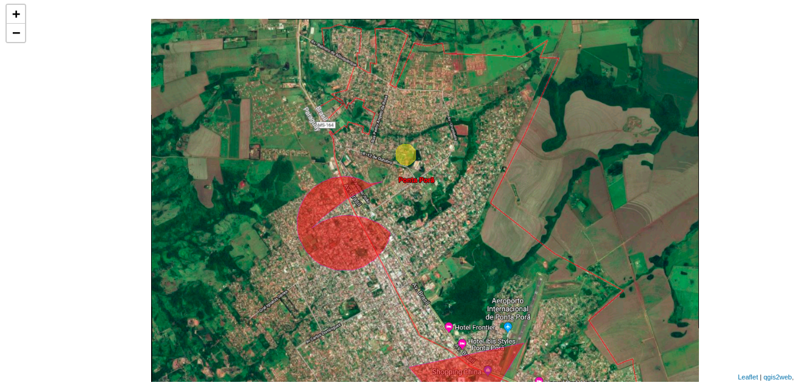

# GIS / QGIS

## Ponta Pora 

I digitize a map of Ponta Pora city, it's a Brazilian city, beside this I did multiple frames and export it to LeafLet where it can be accessed by a web browser.

<!--  -->

### Step 1
I got the image from Google Maps.

### Step 2
Create a New Shape File  with polygon type and right coordenation system. After this draw a geometric figure with the size of your map.

### Step 3
I used Georefencer option in Raster menu for opening the image on QGis.

Quick tip:
If this option isn't able then it's necessary to install the plugin on Manage and Install Plugins in Plugins menu.

### Step 4
Add relative points.

### Step 5
Create a new Shapefile Layer with your new polygons areas.

### Step 6
Export using qgisweb to LeafLet in Web menu.

Quick tip:
If this option isn't able then it's necessary to install the plugin on Manage and Install Plugins in Plugins menu.

### Observations
It's necessary all layers be in the right coordenation system. 

### Sistema de Coordenadas
EPSG:3857

